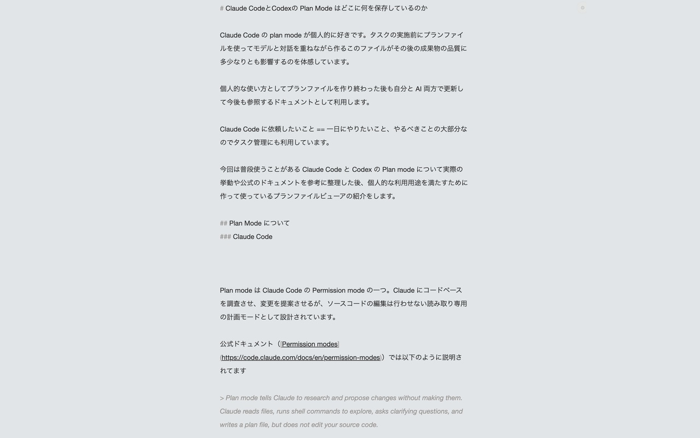
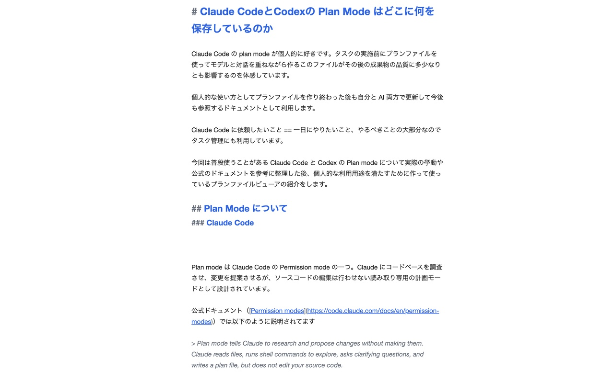
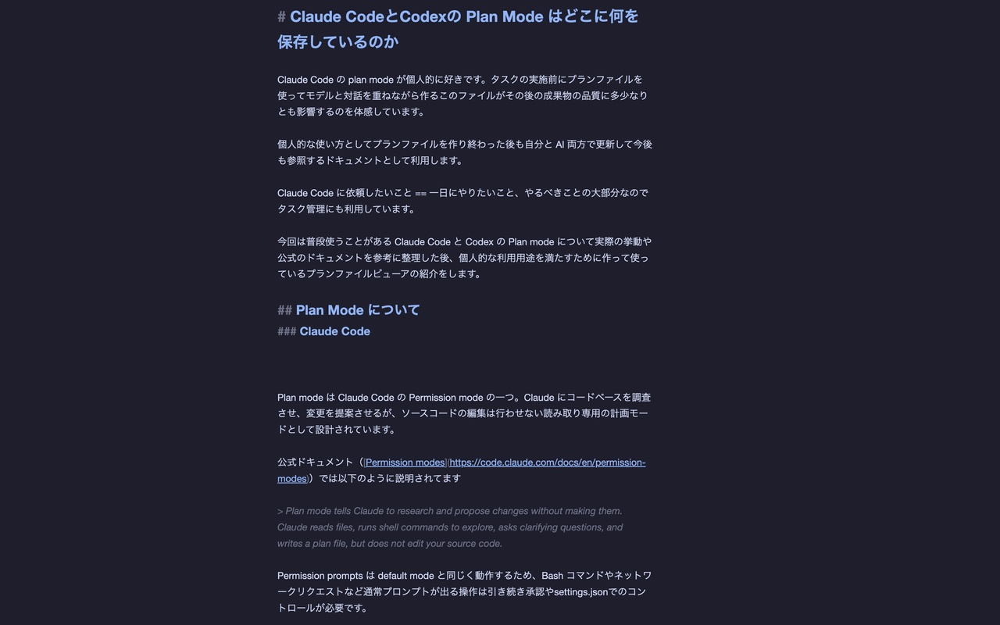
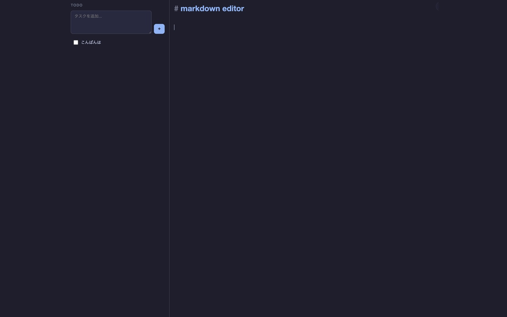

# TabDraft

A Chrome extension that replaces the new tab page with a distraction-free Markdown editor.



## Features

- **Markdown editor** with syntax-aware styling (headings, bold, italic, links, code)
- **Tab / Shift-Tab** to indent/outdent list items
- **TODO list** with completion tracking (optional, hidden by default)
- **4 built-in themes**: System (auto), Light, Dark, Monokai
- **Custom theme** via CSS variables — full control over colors, font size, heading style
- **Auto-focus** on editor when opening a new tab
- **i18n**: English and Japanese (auto-detected from browser settings)
- **Local storage only** — no accounts, no cloud sync, no tracking

## Screenshots

| Custom (OmmWriter-style) | Light |
|---|---|
|  |  |

| Dark | Dark + TODO |
|---|---|
|  |  |

## Install

### Chrome Web Store

Coming soon.

### From source

```bash
pnpm install
pnpm build
```

Then load `dist/` as an unpacked extension in `chrome://extensions`.

## Keyboard Shortcuts

| Shortcut | Action |
|----------|--------|
| Alt+1 | Focus TODO list |
| Alt+2 | Focus Markdown editor |
| Tab | Indent list item |
| Shift+Tab | Outdent list item |

Shortcuts are customizable in the settings dialog (gear icon).

## Custom Themes

Select **Custom** in the theme settings to open the CSS editor. All visual properties are controlled via CSS variables:

```css
:root[data-theme="custom"] {
  /* Colors */
  --bg: #1a1b26;
  --surface: #24283b;
  --text: #c0caf5;
  --accent: #7aa2f7;
  /* ...and more */

  /* Editor */
  --cm-font-size: 18px;
  --cm-line-height: 2.0;
  --cm-content-max-width: 700px;

  /* Heading sizes */
  --cm-h1-size: 1.6em;
  --cm-heading-weight: bold;
  --cm-heading-color: var(--accent);
}
```

See the built-in template (shown when selecting Custom) for the full list of available variables.

## Tech Stack

- [React](https://react.dev/) 19
- [CodeMirror](https://codemirror.net/) 6 with Markdown extension
- [Vite](https://vite.dev/) 7
- TypeScript
- Chrome Extension Manifest V3

## Development

```bash
pnpm install    # Install dependencies
pnpm dev        # Start dev server
pnpm build      # Build for production (outputs to dist/)
```

## License

MIT
